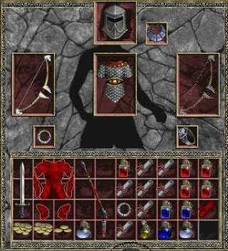

# Let's Make a Grid Based Inventory System
{: .no_toc }

Hello coders! Captain Coder here with another learning series. On the Captain
Coder's Academy discord, it was proposed that I implement an inventory system
live on stream. I felt this fit into the current theme of prepping for the [2023
Dungeon Crawler Game Jam](https://itch.io/jam/dcjam2023) 

This site serves as a blog that will (hopefully) chronicle the streams for
anyone who missed them live and recap what we accomplished each day. I
hope someone finds this blog useful!

* Archived Streams Playlist: [Playlist]
* Catch the Captain Live on Twitch: [Twitch]
* Source Code: [Repository]

## Project Overview

The goal of this project is to create a functional grid based inventory system
similar to that of the original
[Diablo](https://en.wikipedia.org/wiki/Diablo_(video_game)):

More specifically, we would like to create a grid based inventory for which
items may occupy more than a single grid slot.

## Day 1 - Design Document and Project Scope

 Today, we defined our learning goals, specified the scope of the project, setup
a unity project, class class library project, [xUnit] test project, and defined
two interfaces: `IInventoryItem` and `IInventoryGrid`.

* [Read More]()
* [Watch On YouTube](https://youtube.com/live/uRBIHAHNVMw?feature=share)

