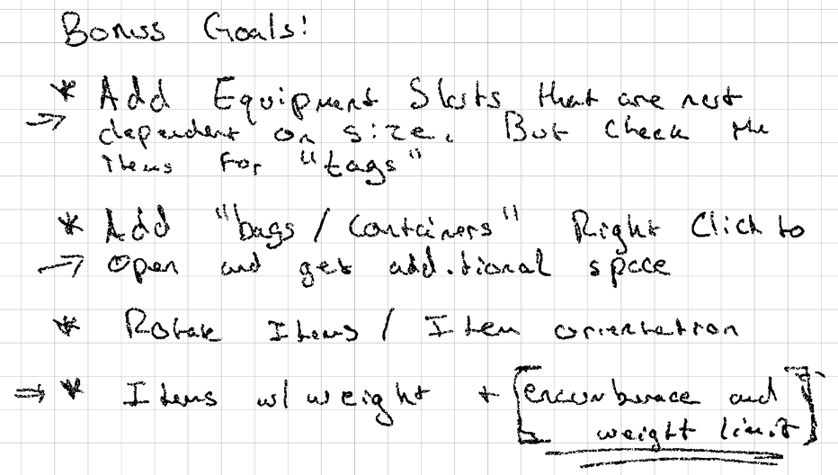

# Day 1: Design Document and Project Scope
{: .no_toc }

The goal of this project is to create a functional grid based inventory system
similar to that of the original
[Diablo](https://en.wikipedia.org/wiki/Diablo_(video_game)). Today, we defined
our learning goals, specified the scope of the project, setup a unity project,
class class library project, [xUnit] test project, and defined two interfaces:
`IInventoryItem` and `IInventoryGrid`.

* [Watch On YouTube](https://youtube.com/live/uRBIHAHNVMw?feature=share)
* [Source Code at the End of Day 1](https://github.com/CaptainCoderOrg/GridBasedInventory/tree/end-of-day-1)


<details open markdown="block">
  <summary>
    Table of contents
  </summary>
  {: .text-delta }
1. TOC
{:toc}
</details>

## Today's Tasks

1. <s>Define Learning Goals and Scope Document</s>
2. <s>Setup Libs / Unity Project / Dependencies</s>
3. <s>Start interface definitions</s>

## Learning Goals

We began by defining a "Learning Goals and Scope" document.

![Learning Goals]

For those who are not fluent in chicken scratch, let me translate for you:

* Practice and expand our knowledge with the UI Toolkit

In the [last project](https://crafting.captaincoder.org/), we learned how to use
the UI Toolkit in play mode within Unity. We followed a tutorial and then made
some tweaks. The primary learning goal is to apply what we learned on a new
project completely from scratch.

* Learn how to make UXML Templates

I read a little bit about UXML Templates and would like to understand them
better. How can they be used? Can they be generalized? Let's find out!

* Explore using variables in USS (Unity Style Sheets)

I've also read that you can add variables to Unity Style Sheets. We definitely
did not do this last time. Let's learn about this and see what the best
practices are and how we can apply them in our project.

## Project Scope

![Scope]

Once again, let me translate:

The primary goal of this project is to implement a re-usable grid base inventory
system in **5 days**! 5 days is not a lot of time but that's how much time we
have this week and gosh-darn-it, we are going to make it happen. That said, the
scope of the project is small to fit within this constraint. I estimate that we
will have roughly 10 hours of "working" time while streaming.

With this in mind, the following scope was defined:

* `InventoryGrid` - A class which tracks the actual inventory. It will
  essentially be a 2 dimensional grid that knows what is (or is not) occupying
  each of its slots.

* `InventoryItem` - A simple interface that the `InventoryGrid` can use to track
  the shape of items within the grid. For simplicity, items will have
  rectangular shapes that take up the full rectangle.

That's it for this project! We intentionally kept the scope small to hopefully
ensure that we can finish in the short time period.

## Bonus Goals



Translation:

If we some how manage to finish all of our previous goals and have time left over,
we have a few bonus goals to explore (or perhaps for a version 0.1!)

* Add Equipment Slots that are not dependent on size. Instead, they use a "tag"
  system to specify which items are eligible to be placed in a slot. This would
  essentially be a very simple equipment system.

* Add "bags / containers" that can be opened. This would need to dynamically
  create an additional "window" on the screen to allow the player to drag items
  between them. One note here is to potentially add a check to not allow bags to
  be nested in other bags. This could likely be done using the tagging system
  above.

* Rotatable Items - This was suggested by a member of the crew and I thought it
  could be fun to implement. Rather than having static item shapes in the grid,
  allow the player to adjust the orientation of each item. This could
  potentially add to the "fun" of inventory management.

* Weighted items and encumbrance - This was also suggested by a member of the
  crew and I thought it could be fun to implement. Each item could have a weight
  associated with it and the inventory grid / player could have a max
  encumbrance.


## Project Setup

With our learning goals defined and a scope in mind, it was time to set up the
project so we could actually code. 

In the [last project](https://crafting.captaincoder.org) we learned that we
could utilize C# 11 (or another language version) in our non-unity related code
by creating a project outside of Unity and adding in a compiled dll to the Unity
project. Additionally, this speeds up Unity compile times and helps to keep our
code organized for more general reuse purposes. With this knowledge available,
we started by adding a submodule to our project referencing the
[CaptainCoder.Core](https://github.com/CaptainCoderOrg/CaptainCoder.Core) that
was created during the last project.

More specifically, we created a branch that we could use while working on the
inventory system. At the time of writing, that branch was available here:
[grid-based-inventory](https://github.com/CaptainCoderOrg/CaptainCoder.Core/tree/grid-based-inventory).
However, it should be merged in to the main branch after the inventory system is
completed and the link may not work at a later date.

Another benefit gained by defining the non-unity portions of the project outside
of Unity is that we can more easily utilize different testing frameworks such as
[xUnit]. In Unity, the main (and only?) testing framework is [nUnit] which is fine
but not my personal preference.

Lastly, we put together a simple build script that will build and add the 
compiled dlls to Unity when changes are made to the project code:

```bash
#!/bin/bash
dotnet build CaptainCoder.Core/ -c Release
CORE_PATH="CaptainCoder.Core/CaptainCoder/Core/bin/Release/netstandard2.1"
CORE="CaptainCoder.Core"
INVENTORY_PATH="CaptainCoder.Core/CaptainCoder/Inventory/bin/Release/netstandard2.1"
INVENTORY="CaptainCoder.Inventory"
UNITY_DLL_PATH="Grid Based Inventory Project/Assets/Plugins/CaptainCoder"
cp "$CORE_PATH/$CORE.dll" \
    "$CORE_PATH/$CORE.xml" \
    "$INVENTORY_PATH/$INVENTORY.dll" \
    "$INVENTORY_PATH/$INVENTORY.xml" \
    "$UNITY_DLL_PATH/"
```

## Start Interface Definitions

With our project definitions ready to go, it was time to implement the
interfaces that we would use for the `IInventoryItem` and `IInventoryGrid`. Each
of these would require a "shape" to define their relative dimensions. Naming is
one of the most challenging parts of programming for me. We tried a few
different names: `Shape`, `Size`, `GridSize`, and `Dimensions`. Not particularly
happy with any of the names, I ultimately settled on `Dimensions`. If anyone has
a better name, please let me know! Below is the high level interface of the struct:

```csharp
/// The readonly <see cref="Dimensions"/> struct defines a discrete rectangular
/// shape using rows and columns.
public readonly record struct Dimensions(int Rows, int Columns) : IEnumerable<Position>
{
    /// Retrieves each position represented within this dimension. The returned
    /// order will be left to right and top to bottom.
    ///
    /// Example:
    /// Dimension d = new Dimension(3,3);
    /// Console.WriteLine(string.Joint(", ", d.Positions));
    /// // $ (0,0), (0, 1), (0, 2), (1, 0), (1, 1), (1, 2), (2, 0), (2, 1), (2, 2)
    public IEnumerable<Position> Positions;
}
```

For brevity, I've left the implementation details of the struct above out. The
full implementation from today can be found here
[Dimensions.cs](https://github.com/CaptainCoderOrg/CaptainCoder.Core/blob/26b3b1d44441674b63b2af473339793a8dd14bb1/CaptainCoder/Inventory/Dimensions.cs)


The interface for `IInventoryItem` is simply a container with a `Dimension`
property that defaults to (1,1).

```csharp
/// The <see cref="IInventoryItem"/> interface specifies an item that can be
/// placed within an <see cref="IInventoryGrid"/>. 
public interface IInventoryItem
{
    /// The amount of space this <see cref="IInventoryItem"/> occupies.
    public Dimensions Size => new (1, 1);
}
```

And the `IInventoryGrid` interface provides a handful of methods for managing the 
contents of the grid:

```csharp

/// The <see cref="IInventoryGrid"/> defines a grid of cells that can hold <see cref="IInventoryItem"/>s.
public interface IInventoryGrid
{
    /// The <see cref="Dimensions"/> of this <see cref="IInventoryGrid"/>
    public Dimensions GridSize => new (4,10);

    /// A enumerable containing one entry for every <see cref="IInventoryItem"/> in this
    /// <see cref="IInventoryGrid"/>
    public IEnumerable<GridSlot> Items { get; }

    /// Attempts to retrieve an item at the specified position. If an item
    /// exists in that position, returns true and populates <paramref
    /// name="item"/> otherwise returns false and the value of <paramref
    /// name="item"/> is undefined.
    public bool TryGetItemAt(Position position, out IInventoryItem item);

    /// Returns true if the specified <see cref="Position"/> is occupied and
    /// false otherwise.
    public bool IsOccupied(Position position);

    /// Attempts to add the specified <paramref name="item"/> to this inventory
    /// by placing its top left corner in the specified <see cref="Position"/>.
    /// Returns true if the <paramref name="item"/> was added successfully and
    /// false otherwise. This method will fail if an item occupies any of the
    /// spaces this item requires.
    public bool TrySetItemAt(Position topLeft, IInventoryItem item);

    /// Attempts to add the specified <paramref name="item"/> to this inventory
    /// by placing its top left corner in the specified <see cref="Position"/>.
    /// Returns true if the <paramref name="item"/> was added successfully and
    /// false otherwise. For convenience, on success if exactly one item
    /// occupied the area that <paramref name="item"/> now occupies, the
    /// <paramref name="removedItem"/> is set to that item. If no such item
    /// existed, the value will be null.
    public bool TrySetItemAt(Position topLeft, IInventoryItem item, out IInventoryItem? removedItem);

    /// Attempts to remove an item at the specified position. Returns true if an
    /// item was present and sets <paramref name="item"/> to the removed item.
    /// Otherwise returns false and <paramref name="item"/> is undefined.
    public bool TryRemoveItemAt(Position position, out IInventoryItem item);

    /// A <see cref="GridSlot"/> represents where the top left corner
    /// of an <see cref="IInventoryItem"/> is within a <see cref="IInventoryGrid"/>
    public record GridSlot(Position TopLeft, IInventoryItem Item, IInventoryGrid Grid);
}
```

And that was it for today! With these data types in place, we should hopefully
be able to write a relatively straight forward implementation tomorrow and spend
the remaining time focused on the UI Toolkit interactions. Will we be able to do it?
Only time will tell! See you tomorrow!

