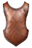

# Day 4: Clickable Items
{: .no_toc }

Today, we used Leonaro.AI to generate equipment graphics, added a UI component
for items, and connected the inventory grid logic with the UI through a
controller script.

* [Watch On YouTube](https://www.youtube.com/watch?v=kMufcKTnmTQ)
* [Source Code at the End of Day 4](https://github.com/CaptainCoderOrg/GridBasedInventory/tree/end-of-day-4)

<details open markdown="block">
  <summary>
    Table of contents
  </summary>
  {: .text-delta }
1. TOC
{:toc}
</details>

## Today's Tasks

1. <s>Find / Generate Item Graphics (1x1), (2x1), (1x2) (2x2), (3x2)</s>
2. <s>Implement base InventoryGridController with drag and drop listeners</s>
3. <s>Wire up InventoryGridController to InventoryGrid logic</s>

## Find / Generate Item Graphics

Before adding the logic to the UI, we wanted to make sure we had items we could
use to test it out. Because the Captain lacks the ability to create art, we
decided to take advantage of Leonardo.AI to generate a few item graphics for us.
We wanted a variety of item shapes so we created 5 different shapes:





## Implement Simple InventoryGridController

The next step was to implement an `InventoryGridController` that could listen
for mouse events and adjust where the images on the screen are placed.

To do this, we added two listeners to the `GridSlotElement`s. One listens
for the pointer entering the slot and the other listens for click events.
These events are propagated through to the `GridElement` which can be
registered on to know the `Position` that was most recently interacted with:

```csharp
public event System.Action<GridSlotElement> OnPointerEntered;
public event System.Action<GridSlotElement> OnClicked;

private void OnPointerEnter(PointerEnterEvent evt) => OnPointerEntered?.Invoke(this);
private void OnPointerDown(PointerDownEvent evt) => OnClicked?.Invoke(this);
```

With this information exposed, the `InventoryGridController` listens for clicks 
and determines if an item is within the slot and "selecting" it. When an item
is selected, it knows how to reposition itself based on the row / col of the mouse:

```csharp
public class GridItemElement<T> : VisualElement where T : class, IGridableItem
{
    private bool IsSelected = false;
    private readonly GridElement _parent;
    public GridItemElement(Core.Position position, T item, GridElement parent)
    {
        // Initialization code omitted for brevity
    }

    // Called when the item is to be placed on the cursor
    public void Select()
    {
        IsSelected = true;
        _parent.OnPointerEntered += HandleMouseMove;
    } 

    // Called when the item should no longer be on the cursor
    public void UnSelect()
    {
        IsSelected = false;
        _parent.OnPointerEntered -= HandleMouseMove;
    }

    // If the item is selected, update its position when
    // the cursor enters a new GridSlot
    private void HandleMouseMove(GridSlotElement slot)
    {
        if (!IsSelected) { return; }
        style.top = slot.Position.Row * _parent.CellSize;
        style.left = slot.Position.Col * _parent.CellSize;
    }
}
```

Full Source: [GitHub](https://github.com/CaptainCoderOrg/GridBasedInventory/blob/end-of-day-4/Grid%20Based%20Inventory%20Project/Assets/CaptainCoder/Inventory/UI/GridElement.cs)

## Wire up Inventory Logic

With this in place, we could move the items freely within the InventoryGrid but
the items themselves were not being moved in the data model. To do this,
we added a few simple checks to the `InventoryGridController` that utilized the
methods we wrote in the logic:

```csharp
public class InventoryGridController<T> : MonoBehaviour where T : class, IGridableItem
{
    // The underlying data model for the inventory
    [field: SerializeField]
    public InventoryGridData<T> InventoryData { get; private set; }

    // Tracks the currently selected item
    private GridItemElement<T> _selected = null;

    // Used to look up the UI elements using the underlying data
    private readonly Dictionary<T, GridItemElement<T>> _itemLookup = new();
    
    // The overall Grid UI element
    private GridElement _gridElement;

    private void Awake()
    {
        VisualElement root = GetComponent<UIDocument>().rootVisualElement;
        _gridElement = root.Q<GridElement>("GridElement");
        // Update the UI Element to the correct dimensions
        _gridElement.UpdateDimensions(InventoryData.InventoryGrid.GridSize);
        // Listens for clicks
        _gridElement.OnClicked += HandleClick;
    }

    public bool AddItem(Core.Position position, T item)
    {
        if (!InventoryData.InventoryGrid.TrySetItemAt(position, item)) { return false; }

        GridItemElement<T> element = new(position, item, _gridElement);
        _gridElement.Add(element);
        _itemLookup[item] = element;
        return true;
    }

    // Determines if the click is picking up, putting down, or swapping an item
    private void HandleClick(GridSlotElement slot)
    {
        if (_selected == null)
        {
            HandleSelect(slot);
        }
        else 
        {
            HandleUnSelect(slot);
        }
    }

    // Called when we click on a slot is clicked and no item is currently selected. 
    // Checks to see if there is anything in the slot
    // if so, attempts to remove it and add it to the mouse cursor
    private void HandleSelect(GridSlotElement slot)
    {
        Debug.Assert(_selected == null, "HandleSelect should only be invoked when nothing is selected.");
        if (InventoryData.InventoryGrid.TryRemoveItemAt(slot.Position, out T item))
        {
            _selected = _itemLookup[item];
            _selected.Select();
        }
    }

    // Called when we click on a slot while holding an item.
    // Checks to see if the item can be added at that slot. If so,
    // checks to see if the add was a swap with another item.
    private void HandleUnSelect(GridSlotElement slot)
    {
        Debug.Assert(_selected != null, "HandleUnSelect should only be invoked when something is selected.");
        if (InventoryData.InventoryGrid.TrySetItemAt(slot.Position, _selected.Item, out T removed))
        {
            _selected.UnSelect();
            _selected = null;
            if (removed != null)
            {
                _selected = _itemLookup[removed];
                _selected.Select();
            }
        }
    }

}
```

And with that, we have a very simple but working grid based inventory system:

<video autoplay="true" loop="true" style="max-width:700px">
  <source src="../imgs/click-inventory.webm" type="video/webm">
</video>

With one day to spare, we hope to clean up some of the more finicky UI things
and see how difficult it will be to combine the inventory system with the
[crafting system](https://crafting.captaincoder.org) we wrote last week.

